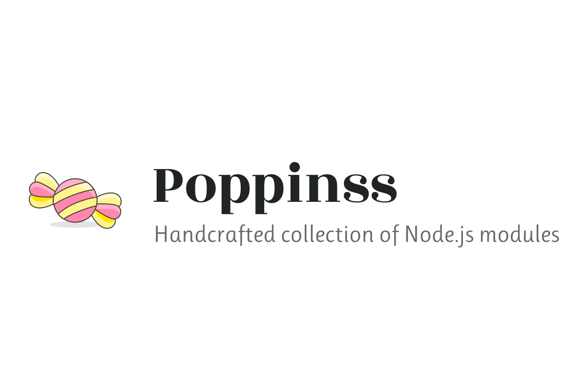

# 

# Request
[![circleci-image]][circleci-url] [![npm-image]][npm-url] 

Wrapper over Node.js [req](https://nodejs.org/dist/latest/docs/api/http.html#http_class_http_incomingmessage) object to standardize and ease the process of reading data from HTTP requests.

<!-- START doctoc generated TOC please keep comment here to allow auto update -->
<!-- DON'T EDIT THIS SECTION, INSTEAD RE-RUN doctoc TO UPDATE -->
## Table of contents

- [Features](#features)
- [Change log](#change-log)
- [Contributing](#contributing)
- [Authors & License](#authors--license)

<!-- END doctoc generated TOC please keep comment here to allow auto update -->

## Features
1. Support for reading plain and signed cookies (only when signed via [@poppinss/response](https://github.com/poppinss/response))
2. Handy methods for content negotiation.
3. Handles inconsistencies between certain headers like `referer` and `referrer`.
4. Reliably reads `ip address` of proxied requests.
5. Assigns distributed unique `x-request-id` to each request.

## Change log
The change log can be found in the [CHANGELOG.md](CHANGELOG.md) file.

## Contributing

Everyone is welcome to contribute. Please go through the following guides, before getting started.

1. [Contributing](https://adonisjs.com/contributing)
2. [Code of conduct](https://adonisjs.com/code-of-conduct)

## Authors & License
[Harminder virk](https://github.com/thetutlage) and [contributors](https://github.com/poppinss/request/graphs/contributors).

MIT License, see the included [MIT](LICENSE.md) file.

[circleci-image]: https://img.shields.io/circleci/project/github/poppinss/request/master.svg?style=flat-square&logo=circleci
[circleci-url]: https://circleci.com/gh/poppinss/request "circleci"

[npm-image]: https://img.shields.io/npm/v/@poppinss/request.svg?style=flat-square&logo=npm
[npm-url]: https://npmjs.org/package/@poppinss/request "npm"
